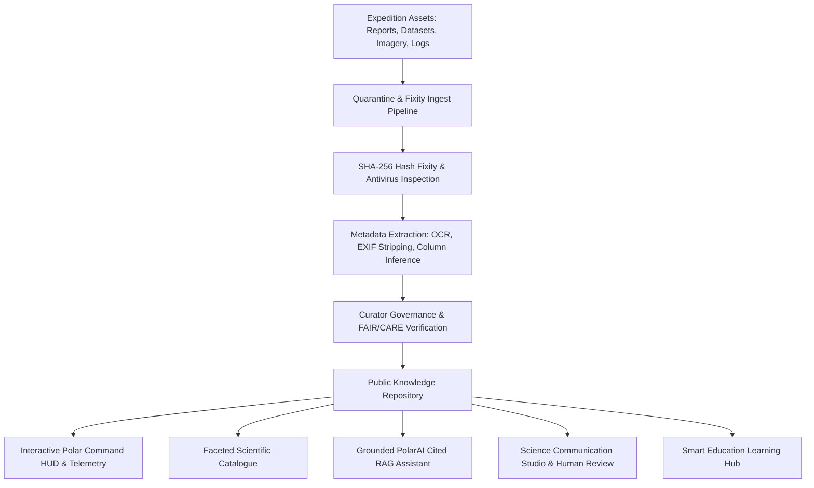

# PolarConnect Architecture Documentation
**SIH Problem Statement 26063: Integrated Polar Science Outreach, Knowledge Repository, and Media Dissemination Portal**
**Client / Stakeholders:** Ministry of Earth Sciences (MoES) / National Centre for Polar and Ocean Research (NCPOR) / National Polar Data Centre (NPDC)

---

## 1. Executive Summary

PolarConnect is designed as a **trusted discovery and public outreach layer** connected to, rather than replacing, the National Polar Data Centre (NPDC). The platform bridges the communication gap between complex polar field expeditions (Antarctica, Arctic, Southern Ocean, Himalayas) and multiple stakeholders: students, teachers, journalists, policy analysts, and international research peers.

---

## 2. Core Architectural Principles

1. **Federated Discovery over Redundant Storage:** Authoritative data remains stewarded at NPDC and NCPOR servers; PolarConnect manages rich semantic metadata, public-safe derivatives, and deep authoritative links.
2. **FAIR & CARE Compliance:**
   - **Findable:** Granular indexing by GCMD keywords, temporal/spatial bounding boxes, and persistent identifiers.
   - **Accessible:** Clear access policies (`public`, `quarantined`, `embargoed`, `restricted`) with automated rights checking.
   - **Interoperable:** Controlled schemas, JSON-LD (`schema.org/Dataset`, `schema.org/CreativeWork`), and W3C PROV-O graph representation.
   - **Reusable:** Explicit CC-BY / NCPOR Open Data licensing, provenance records, and citation generators.
   - **CARE:** Ethical data governance ensuring indigenous/sensitive geographic privacy (EXIF/GPS sanitization for vulnerable environments).
3. **Evidence-Grounded RAG (Retrieval-Augmented Generation):**
   - Grounded strictly in approved, published assets.
   - Refusal of unverified, private, or embargoed queries.
   - Mandatory claim-to-source mapping (`claim -> assetVersionId -> page/locator -> sourceUrl`).
4. **Human-in-the-Loop Science Dissemination:**
   - AI generates communication packs (Student Explainers, Press Releases, Visual Carousels) with draft watermarks.
   - Requires verified reviewer sign-off before public distribution.

---

## 3. Technology Stack

- **Client Application:** React 18+, TypeScript, Tailwind CSS, Lucide Icons, Glassmorphic Polar Design System with responsive projection maps and audio/video previewers.
- **Backend Service:** Node.js / Express with TypeScript, RESTful endpoints, streaming upload handler, SHA-256 fixity worker, and lexical/vector hybrid search simulator.
- **Knowledge Base:** Normalized JSON/Document storage with ACID-like atomic transitions and immutable audit logs.
- **Search & Vector Retrieval:** Hybrid lexical and semantic retrieval engine matching against extracted text chunks with confidence scoring.
