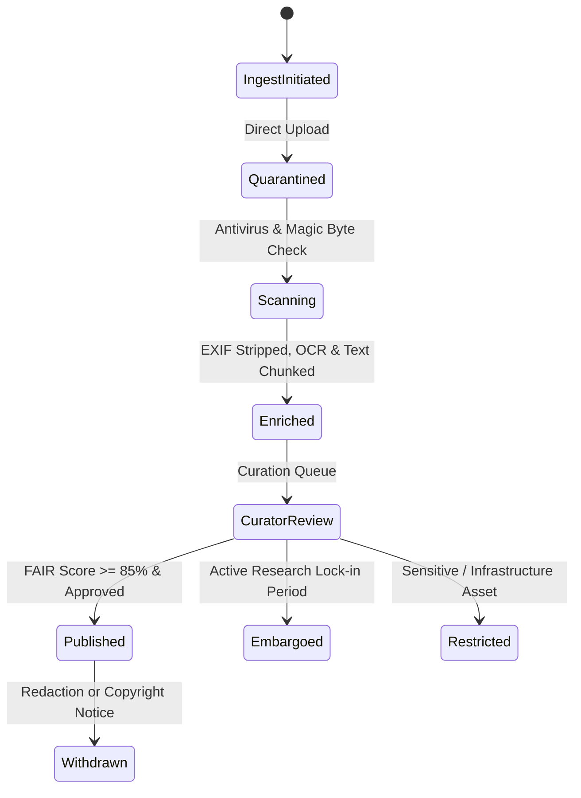

# PolarConnect Data Governance, Rights & Security Framework

## 1. Compliance Matrix

| Standard / Policy | Alignment in PolarConnect |
|---|---|
| **FAIR Principles** | Persistent identifiers, schema.org JSON-LD microdata, faceted metadata search, CC-BY licensing. |
| **CARE Principles** | Indigenous & local ethical governance; sensitivity flags on vulnerable ecological sampling sites. |
| **ISO 14721 (OAIS)** | Strict separation of Submission Information Package (SIP), Archival Information Package (AIP), and Dissemination Information Package (DIP). |
| **W3C PROV-O** | Lineage tracking (`wasDerivedFrom`, `wasGeneratedBy`, `used`) from raw sensor/field capture to public media release. |
| **MoES/NCPOR Polar Policy** | Mandatory 12-month NPDC submission clause and configurable 2-to-5 year research embargo periods. |

## 2. Ingestion & Rights Lifecycle

## 3. Privacy & Media Protection
1. **EXIF GPS Stripping:** Public photo and video derivatives have device serials, camera identifiers, and precise sub-meter GPS coordinates removed to safeguard sensitive nesting sites and critical station communications.
2. **Watermarking & Consent:** Contributor consent is verified prior to asset publication. Unreviewed communication drafts feature immutable watermarks.
3. **Audit Immutability:** Every transition, policy modification, and download entitlement verification is recorded in an append-only audit trail.
